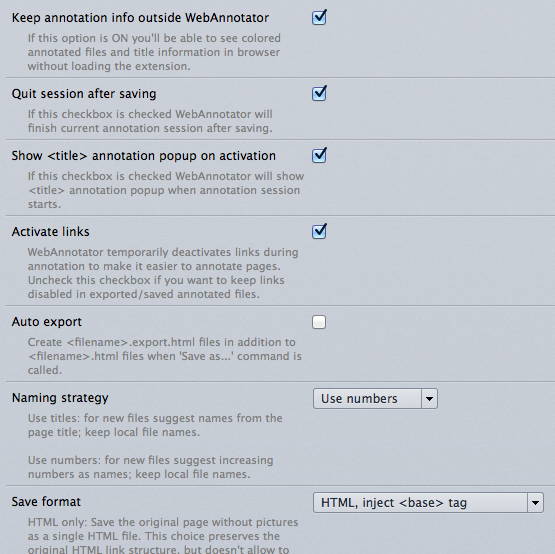

Tutorial
========

This tutorial assumes you are familiar with machine learning.

Get annotated data
------------------

First, you need the training/development data. We suggest to use
WebAnnotator_ Firefox extension to annotate HTML pages.

Recommended WebAnnotator options:

Pro tip - enable WebAnnotator toolbar buttons:

.. image:: images/wa-buttons.png

Follow WebAnnotator `manual <http://perso.limsi.fr/xtannier/en/WebAnnotator/>`__
to define named entities and annotate some web pages
(nested WebAnnotator entities are not supported).

After that you can load annotated webpages as lxml trees:

>>> import webstruct
>>> trees = webstruct.load_trees([
...    ("train/*.html", webstruct.WebAnnotatorLoader())
... ])

See :ref:`html-loaders` for more info.
GATE_ annotation format is also supported.

.. _WebAnnotator: https://github.com/xtannier/WebAnnotator
.. _GATE: http://gate.ac.uk/

From HTML to Tokens
-------------------

To convert HTML trees to a format suitable for sequence prediction algorithm
(like CRF, MEMM or Structured Perceptron) the following approach is used:

1. Text is extracted from HTML and split into tokens.
2. For each token a special :class:`~.HtmlToken` instance is created. It
   contains information not only about the text token itself, but also about
   its position in HTML tree.

A single HTML page corresponds to a single sequence (a list of HtmlTokens).

To transform HTML trees into labels and HTML tokens
use :class:`~.HtmlTokenizer`:

>>> html_tokenizer = webstruct.HtmlTokenizer()
>>> X, y = html_tokenizer.tokenize(trees)

Input trees should be loaded by one of the WebStruct loaders.

For each tree :class:`~.HtmlTokenizer` extracts two arrays: a list of
:class:`~.HtmlToken` instances and a list of tags encoded
using IOB2_ encoding (also known as BIO encoding).
So in our example ``X`` is a list of lists of :class:`~.HtmlToken`
instances, and  ``y`` is a list of lists of strings.

.. _IOB2: http://en.wikipedia.org/wiki/Inside_Outside_Beginning

Feature Extraction
------------------

For supervised machine learning algorithms to work we need to extract
`features <http://en.wikipedia.org/wiki/Features_%28pattern_recognition%29>`_.

In WebStruct feature vectors are Python dicts
``{"feature_name": "feature_value"}``; a dict is computed for
each HTML token. How to convert these dicts into representation required
by a sequence labelling toolkit depends on a toolkit used; we will cover
that later.

To compute feature dicts use :class:`~.HtmlFeatureExtractor`.
First, define your feature functions. A feature function should take
an :class:`~.HtmlToken` instance and return a feature dict;
feature dicts from individual feature functions will be merged
into the final feature dict for a token. Such functions can ask questions
about token itself, its neighbours (in the same HTML element),
its position in HTML.

There are predefined feature functions in :mod:`webstruct.features`,
but for this tutorial let's create some functions ourselves::

    def token_identity(html_token):
        return {'token': html_token.token}

    def token_isupper(html_token):
        return {'isupper': html_token.token.isupper()}

    def parent_tag(html_token):
        return {'parent_tag': html_token.parent.tag}

    def border_at_left(html_token):
        return {'border_at_left': html_token.index == 0}

Next, create :class:`~.HtmlFeatureExtractor` and use it to extract
feature dicts:

>>> feature_extractor = HtmlFeatureExtractor(
...     token_features = [
...         token_identity,
...         token_isupper,
...         parent_tag,
...         border_at_left
...     ]
... )
>>> features = feature_extractor.fit_transform(X)

WebStruct supports another kind of feature functions that work on multiple
tokens; we don't cover them in this tutorial.

See :ref:`feature-extraction` for more info about HTML tokenization and
feature extraction.

Using a Sequence Labelling Toolkit
----------------------------------

WebStruct doesn't provide a CRF or Structured Perceptron implementation;
learning and prediction is supposed to be handled by an external
sequence labelling toolkit like Wapiti_, CRFSuite_ or seqlearn_.

Once feature dicts are extracted from HTML you should convert them to
a format required by your sequence labelling tooklit and use this toolkit
to train a model and do the prediction. For example, you may use
DictVectorizer from scikit-learn to convert feature dicts
into seqlearn_ input format.

.. _wapiti: http://wapiti.limsi.fr
.. _CRFSuite: http://www.chokkan.org/software/crfsuite/
.. _seqlearn: https://github.com/larsmans/seqlearn

WebStruct provides some helpers for Wapiti_ sequence labelling toolkit.
To use Wapiti with WebStruct, you need

* **for training:** wapiti C++ library itself, including ``wapiti``
  command-line utility (python-wapiti wrapper is not necessary);
* **for prediction:** `python-wapiti <https://github.com/adsva/python-wapiti>`_
  wrapper, github version (C++ library is not necessary).

We'll use Wapiti in this tutorial.

Defining a Model
~~~~~~~~~~~~~~~~

Basic way to define CRF model is the following:

>>> model = webstruct.create_wapiti_pipeline('mymodel.wapiti',
...     token_features = [token_identity, token_isupper, parent_tag, border_at_left],
...     train_args = '--algo l-bfgs --maxiter 50 --compact'
... )

First :func:`.create_wapiti_pipeline` argument is a file name Wapiti
model will be save to after training.
``train_args`` is a string or a list with arguments passed to wapiti;
check Wapiti `manual <http://wapiti.limsi.fr/manual.html>`__ for available
options.

Under the hood :func:`.create_wapiti_pipeline` creates a
``sklearn.pipeline.Pipeline`` with an :class:`~.HtmlFeatureExtractor` instance
followed by :class:`~.WapitiCRF` instance. The example above is just a shortcut
for the following::

    model = Pipeline([
        ('fe', HtmlFeatureExtractor(
            token_features = [
                token_identity,
                token_isupper,
                parent_tag,
                border_at_left,
            ]
        )),
        ('crf', WapitiCRF(
            'mymodel.wapiti',
            train_args = '--algo l-bfgs --maxiter 50 --compact',
        )),
    ])

Extracting Features using Wapiti Templates
~~~~~~~~~~~~~~~~~~~~~~~~~~~~~~~~~~~~~~~~~~

Wapiti_ has "templates" support which allows to define richer features
from the basic features, and to specify what to do with labels.
Template format is described in Wapiti
`manual <http://wapiti.limsi.fr/manual.html#patterns>`__; you may also
check `CRF++ docs <http://crfpp.googlecode.com/svn/trunk/doc/index.html#templ>`__
to get the templates idea - CRF++ and Wapiti template formats are very similar.

WebStruct allows to use feature names instead of numbers in Wapiti templates.

Let's define a template that will make Wapiti use first-order transition
features, plus ``token`` text values in a +-2 window near the current token.

>>> feature_template = '''
... # Label unigram & bigram
... *
...
... # Nearby token unigrams
... uLL:%x[-2,token]
... u-L:%x[-1,token]
... u-R:%x[ 1,token]
... uRR:%x[ 2,token]
... '''

.. note::

    :func:`.create_wapiti_pipeline` (via :class:`~.WapitiCRF`) by default
    adds all features for the current token to template. That's why we
    haven't defined them in our template, and that's why we were fine
    without using template at all. In our example additional
    auto-generated lines would be

    ::

        ufeat:token=%x[0,token]
        ufeat:isupper=%x[0,isupper]
        ufeat:parent_tag=%x[0,parent_tag]
        ufeat:border_at_left=%x[0,border_at_left]

To make Wapiti use this template, pass it as an argument to
:func:`.create_wapiti_pipeline` (or :class:`~.WapitiCRF`, whatever you use):

>>> model = webstruct.create_wapiti_pipeline('mymodel.wapiti',
...     token_features = [token_identity, token_isupper, parent_tag, border_at_left],
...     feature_template = feature_template,
...     train_args = '--algo l-bfgs --maxiter 50 --compact'
... )

Training
~~~~~~~~

To train a model use its ``fit`` method::

>>> model.fit(X, y)

``X`` and ``y`` are return values of :meth:`.HtmlTokenizer.tokenize`
(a list of lists of :class:`~.HtmlToken` instances and a list of
lists of string IOB labels).

If you use :class:`~.WapitiCRF` directly then train it using
:meth:`.WapitiCRF.fit` method. It accepts 2 lists: a list of lists of
feature dicts, and a list of lists of tags:

>>> crf.fit(features, y)

Named Entity Recognition
~~~~~~~~~~~~~~~~~~~~~~~~

Once you got a trained model you can use it to extract entities
from unseen (unannotated) webpages. First, get some binary HTML data:

>>> import urllib2
>>> html = urllib2.urlopen("http://scrapinghub.com/contact").read()

Then create a :class:`~.NER` instance initialized with a trained model:

>>> ner = webstruct.NER(model)

The ``model`` must provide a ``transform`` method that extracts features
from HTML tokens and predicts labels for these tokens. A pipeline created with
:func:`.create_wapiti_pipeline` function fits this definition.

Finally, use :meth:`.NER.extract` method to extract entities:

>>> ner.extract(html)
[('Scrapinghub', 'ORG'), ..., ('Iturriaga 3429 ap. 1', 'STREET'), ...]

Generally, the steps are:

1. Load data using :class:`~.HtmlLoader` loader. If a custom HTML cleaner
   was used for loading training data make sure to apply it here as well.
2. Use the same ``html_tokenizer`` as used for training to extract HTML tokens
   from loaded trees. All labels would be "O" when using :class:`~.HtmlLoader`
   loader - ``y`` can be discarded.
3. Use the same ``feature_extractor`` as used for training to extract
   features.
4. Run ``your_crf.transform()`` method (e.g. :meth:`.WapitiCRF.transform`)
   on features extracted in (3) to get the prediction - a list of IOB2-encoded
   tags for each input document.
5. Build entities from input tokens based on predicted tags
   (check :meth:`.IobEncoder.group` and :func:`.smart_join`).
6. Split entities into groups (optional). One way to do it is to use
   :mod:`webstruct.grouping`.

:class:`~.NER` helper class combines HTML loading, HTML tokenization,
feature extraction, CRF model, entity building and grouping.

Entity Grouping
~~~~~~~~~~~~~~~

Detecting entities on their own is not always enough; in many cases
what is wanted is to find the relationship between them. For example,
"**street_name/STREET city_name/CITY zipcode_number/ZIPCODE**
form an address", or "**phone/TEL** is a phone of **person/PER**".

The first approximation is to say that all entities from a single webpage
are related. For example, if we have extracted some **organizaion/ORG** and some
**phone/TEL** from a single webpage we may assume that the phone
is a contact phone of the organization.

Sometimes there are several "entity groups" on a webpage. If a page
contains contact phones of several persons or several business locations
it is better to split all entities into groups of related
entities - "person name + his/her phone(s)" or "address".

WebStruct provides an :ref:`unsupervised algorithm <grouping-algorithm>`
for extracting such entity groups. Algorithm prefers to build
large groups without entities of duplicate types; if a split is needed
algorithm tries to split at points where distance between entities is larger.

Use :meth:`.NER.extract_groups` to extract groups of entities:

>>> ner.extract_groups(html)
[[...], ... [('Iturriaga 3429 ap. 1', 'STREET'), ('Montevideo', 'CITY'), ...]]

Sometimes it is better to allow some entity types to appear
multuple times in a group. For example, a person (PER entity) may have
several contact phones and faxes (TEL and FAX entities) - we should penalize
groups with multiple PERs, but multiple TELs and FAXes are fine.
Use ``dont_penalize`` argument if you want to allow some entity types
to appear multiple times in a group::

    ner.extract_groups(html, dont_penalize={'TEL', 'FAX'})

The simple algorithm WebStruct provides is by no means a general solution
to relation detection, but give it a try - maybe it is enough for your task.

Model Development
-----------------

TODO

Pipeline created by :func:`.create_wapiti_pipeline` has a big advantage:
it can b
